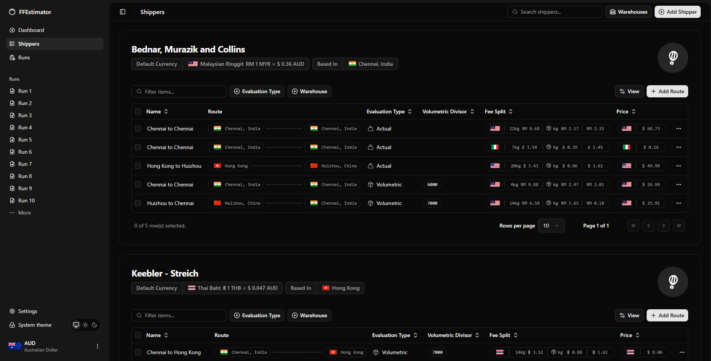
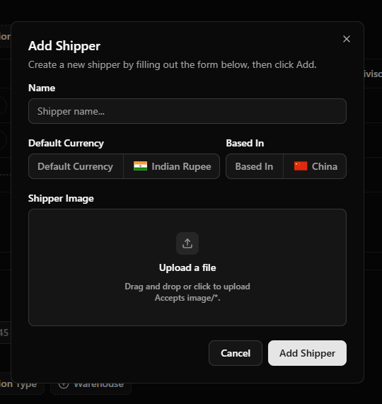
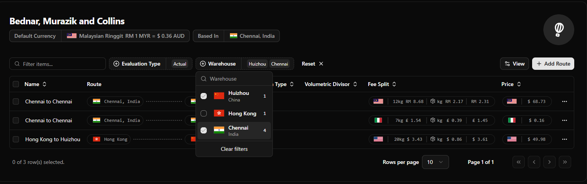
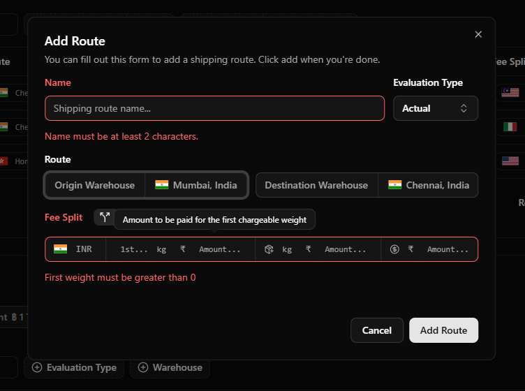
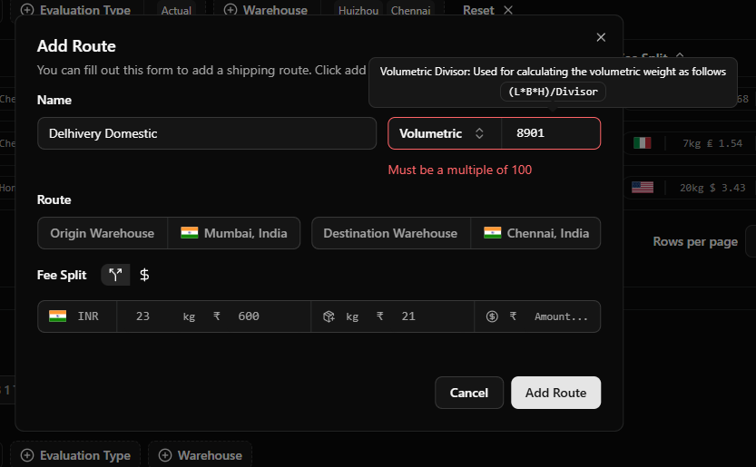
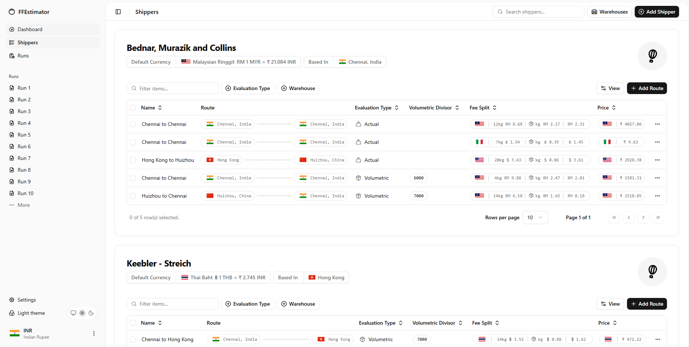
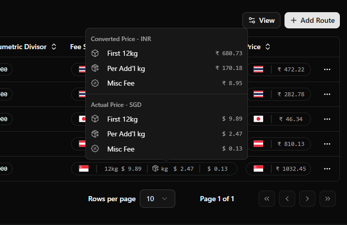

````markdown
# 🚢 Freight Estimator

Freight Estimator is a hobby project created to explore **modern React 19 features** (the new `use` hook with Suspense, transitions, etc.) while building a practical tool for estimating freight and shipping costs.

✨ At a glance: Freight Estimator consolidates items ➝ packages ➝ runs. It calculates item cost, shipping cost per-route, per-item breakdowns, and total run cost — while handling **multi-currency conversions** and current market exchange rates.

---

## 🌟 Highlights

- 📦 Consolidate **items** into **packages**, and packages into **runs**
- 🔀 Support for multiple **shipping routes per package**
- 💰 Per-route and per-item **shipping cost breakdowns**
- ⚖️ Volumetric and actual weight pricing (configurable divisor)
- 💱 Built-in **currency conversion** across routes and runs with up-to-date rates

---

## 🛠 Planned / Primary Tech Stack

- ⚛️ React 19+ with TypeScript (frontend)  
- 🦀 Tauri + Rust (backend)  
- 🗄 SQLite (local data persistence)

---

## 🧩 Primary Domain Entities

1. **Runs** — group of packages shipped together (with a canonical run currency)  
2. **Packages** — collections of items; each can be shipped multiple times via routes  
3. **Items** — products with cost, dimensions, metadata (URL, notes)  
4. **Shippers** — carriers with warehouses & shipping routes (rules, currencies, evaluation types)

---

## ⚙️ How It Works (High Level)

- ➕ Create **items**, group into **packages**, then group into **runs**  
- 🚚 Assign packages to one or more **shipping routes**  
- ⚖️ Routes can be priced by **actual weight** or **volumetric weight** (configurable divisor)  
- 💱 Shipper prices are converted to the **run currency** using live exchange rates  
- 🔄 Rates refresh when items, packages, or routes change

---

## 📝 Useful Notes

- 📎 Items & packages support metadata (URLs, tracking numbers, notes)  
- 📴 Offline-first friendly — local **SQLite store** via Rust (Tauri)  

---

## 🖼 Screenshots

A gallery of representative UI screenshots from the `screens/` folder. Click any thumbnail to open the full-size image. Thumbnails are constrained to 240px for a compact layout.

### Shippers
<div style="display:flex;flex-wrap:wrap;gap:12px">
  <figure style="width:240px;margin:0">
    <a href="./screens/shippers.png"></a>
    <figcaption style="font-size:0.9em;margin-top:6px">`shippers.png` — Shippers list</figcaption>
  </figure>

  <figure style="width:240px;margin:0">
    <a href="./screens/shipper-add.png"></a>
    <figcaption style="font-size:0.9em;margin-top:6px">`shipper-add.png` — Add shipper modal</figcaption>
  </figure>

  <figure style="width:240px;margin:0">
    <a href="./screens/shipper-filters.png"></a>
    <figcaption style="font-size:0.9em;margin-top:6px">`shipper-filters.png` — Filter & search UI</figcaption>
  </figure>
</div>

### Shipping routes
<div style="display:flex;flex-wrap:wrap;gap:12px;margin-top:12px">
  <figure style="width:240px;margin:0">
    <a href="./screens/shipping-route-add.png"></a>
    <figcaption style="font-size:0.9em;margin-top:6px">`shipping-route-add.png` — Add shipping route</figcaption>
  </figure>

  <figure style="width:240px;margin:0">
    <a href="./screens/shipping-route-add-2.png"></a>
    <figcaption style="font-size:0.9em;margin-top:6px">`shipping-route-add-2.png` — Alternate route form</figcaption>
  </figure>
</div>

### UI & Theme
<div style="display:flex;flex-wrap:wrap;gap:12px;margin-top:12px">
  <figure style="width:240px;margin:0">
    <a href="./screens/light-theme.png"></a>
    <figcaption style="font-size:0.9em;margin-top:6px">`light-theme.png` — Light theme preview</figcaption>
  </figure>
</div>

### Currency / Rates
<div style="display:flex;flex-wrap:wrap;gap:12px;margin-top:12px">
  <figure style="width:240px;margin:0">
    <a href="./screens/current-conversion-rates.png"></a>
    <figcaption style="font-size:0.9em;margin-top:6px">`current-conversion-rates.png` — Currency rates view</figcaption>
  </figure>
</div>

---

## ⚡️ Prerequisites

- Node.js (18+)  
- npm or pnpm  
- Rust & Tauri toolchain (optional, for desktop build)  

---

## 🚀 Getting Started

### ▶ Run in development
```powershell
npm run dev
````

### 🏗 Build

```powershell
npm run build
```

### 🔍 Preview production build

```powershell
npm run preview
```

---

## 📂 Project Layout (Important Folders)

```
src/                  # Main frontend app
  ├─ types/           # TypeScript schemas (Runs, Packages, Items, Shippers)
  ├─ components/
  │   ├─ modals/      # CRUD modals (shippers, warehouses, routes, etc.)
  │   └─ table/       # Tables & data views
```

---

## 📚 Third-Party Libraries

**Key Libraries:**

* 🎨 shadcn/ui (Radix primitives)
* 🔧 lodash
* 🖼 lucide-react (icons)
* 📝 react-hook-form
* 🎨 tailwindcss
* ✅ zod (runtime validation)
* 📊 @tanstack/react-table

**Others:**

* 🖱 @dnd-kit (drag & drop)
* 📂 react-dropzone (file uploads)
* 🛣 react-router (routing)
* 📈 recharts (charts)
* 🔔 sonner (toasts)
* 🆔 uuid
* 🎭 @faker-js/faker (mock data)
* 🎛 clsx, tailwind-merge, motion, cmdk, class-variance-authority
* ⚡️ Dev tooling: Vite, TypeScript, ESLint, @vitejs/plugin-react-swc

---

## 🛣 Next Steps / Roadmap

* 🔧 Backend with Tauri + Rust + SQLite
* 📤 Add migrations & endpoints for uploads, shippers, runs, packages
* 🔄 Implement background **exchange-rate refresh** and caching

---

```
```
